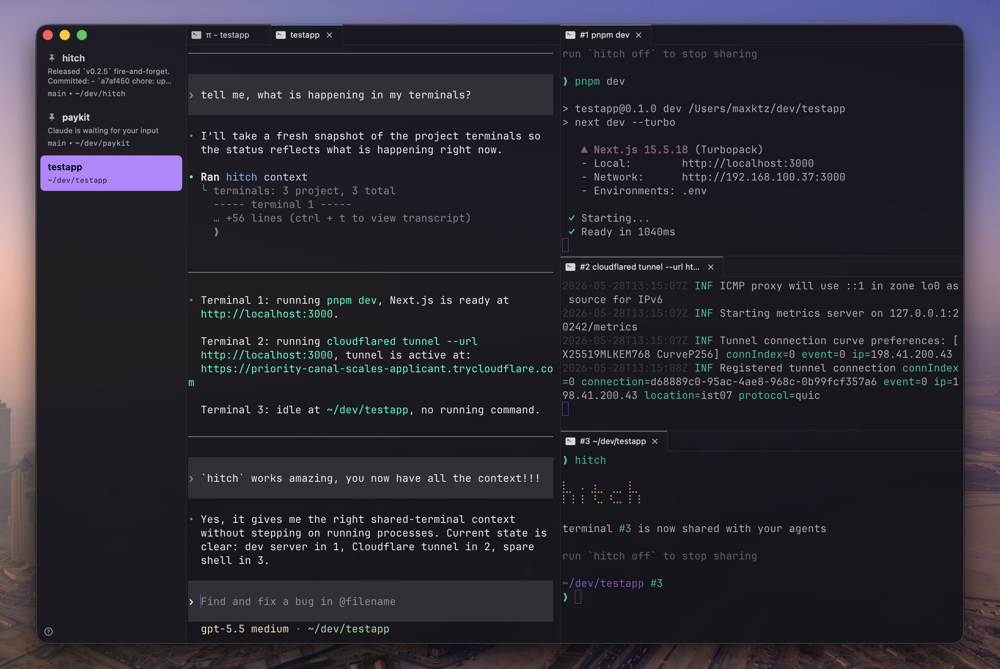

<br>

<p align="center">
  <a name="readme-top"></a>
  <a href="https://github.com/maxktz/hitch">
    <picture>
      <source media="(prefers-color-scheme: dark)" srcset="assets/logo-dark.svg">
      <source media="(prefers-color-scheme: light)" srcset="assets/logo-light.svg">
      
    </picture>
  </a>
</p>

<p align="center">
  <a href="README.md">English</a> · <strong>简体中文</strong> · <a href="README.ja.md">日本語</a>
</p>

<h3 align="center">与编程智能体共享你的终端</h3>

<p align="center">
  让智能体检查并控制你已经在运行的终端。
</p>

<p align="center">
  <a href="https://github.com/maxktz/hitch"><strong>GitHub</strong></a> ·
  <a href="https://www.npmjs.com/package/hitch-cli"><strong>NPM</strong></a> ·
  <a href="https://x.com/maxktz"><strong>作者</strong></a>
</p>

<p align="center">
  <a href="https://www.npmjs.com/package/hitch-cli"></a>
  <a href="https://www.npmjs.com/package/hitch-cli"></a>
  <a href="https://www.npmjs.com/package/hitch-cli"></a>
</p>

<p align="center">
  
</p>

---

## Hitch 是什么？

Hitch 是一个轻量级 CLI，用于与 AI 编程智能体共享真实终端。运行 `hitch` 后，智能体即可获取终端上下文、发送按键或执行命令，并检查输出。

它能避免智能体重复启动开发服务器或隧道，也省去了将日志复制粘贴给智能体的麻烦。

它不是 `tmux` 那样的终端多路复用器 UI。你的终端仍然像普通 shell 一样使用；Hitch 只会代理输入/输出、记录有用的上下文，并提供对智能体友好的命令。

## 安装

```sh
npm install -g hitch-cli
hitch
```

首次运行时，向导会使用 [skills.sh](https://skills.sh) CLI 帮助你配置 `SKILL.md`。

> 支持的平台：采用 arm64 或 x64 架构的 macOS 和 Linux。

## 使用方法

开始共享当前终端：

```sh
hitch
```

停止共享：

```sh
unhitch
# or
hitch off
```

> 对用户来说，这些就是所需的全部操作！其余命令是为智能体提供的。

## SKILL.md

该文件会帮助智能体在启动时安装 Hitch；如需重新安装或更新，请运行：

```sh
hitch setup # recommended, uses 'npx skills'
# or
npx skills add https://github.com/maxktz/hitch skill hitch
```

> 如果你想了解智能体如何使用 Hitch，请运行 `hitch --skill` 查看其内容 :D
